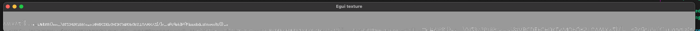

# Troubleshooting loading Egui's texture with Luminance

This repo renders Egui's texture the exact same way, same shaders, same rendering flow, on both the GL and WebGL2 backends of Luminance.

The rendering for both occurs in `texture.rs`.

## Run app on web

```
$ yarn serve
```

http://localhost:8080

(Don't forget to `yarn`)

Execution begins at `start()` in `web.rs`.

## Run app on native

```
cargo run
```

# Screenshots

Here are screenshots so you don't have to run it.

Notes:
* There's a clear color of `0.6, 0.6, 0.6, 1.` set on the pipeline so that we know any white is rendered from the shaders
* The characters are upside-down and backwards, probably just due to a coordinate orientation difference between the window and Egui's texture (I feel like I saw a comment about this in the Egui source code but I don't have it handy)

## Rendered on desktop



This window has the dimensions of the texture, 2048x64.

## Rendered on web


This is a 2048x64 canvas against a dark blue background. The gray clear color set on the graphics pipeline is not displayed, so the background gray color is from the CSS style on the canvas (when the background of the canvas is white, then every pixel appears white).

There's a real difference in how this texture is being rendered by these shaders under WebGL, maybe the difference is due to sampler interpolation? A difference in how WebGL2 handles pre-multiplied alpha?


